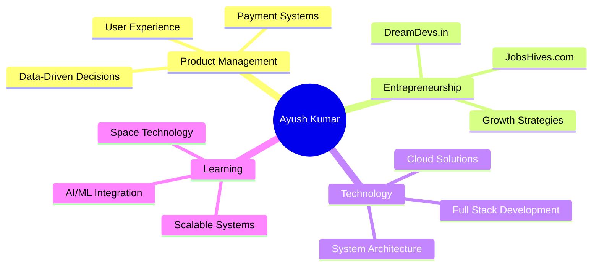

# 👋 Hey there, I'm Ayush Kumar

<div align="center">
  
</div>

<div align="center">
  
[](http://ayushkr.com)
[](https://github.com/ayushkr459)
[](https://github.com/ayushkr459)

</div>

---

## 🚀 About Me


```javascript
const ayushKumar = {
    role: "Product Manager @ Payments Industry",
    currentProjects: ["jobshives.com", "dreamdevs.in"],
    passion: ["Solving Real World Problems", "Space Technology"],
    focus: ["Product Management", "Full Stack Development"],
    interests: ["Data Analytics", "Growth Hacking", "Fintech"],
    currentlyLearning: ["Advanced React Patterns", "System Design"],
    askMeAbout: ["Product Strategy", "Payments", "Startup Building"],
    funFact: "I'm fascinated by how space agencies work! 🚀"
};
```

### 🎯 What I'm Building

- **🏢 [JobsHives.com](https://jobshives.com)** - Revolutionizing the job search experience
- **💻 [DreamDevs.in](https://dreamdevs.in)** - Empowering developers with cutting-edge opportunities
- **💳 Payment Solutions** - Creating seamless payment experiences at scale

---

## 🛠️ Tech Arsenal

### 💻 Languages & Frameworks
<div align="center">


</div>

### 🔧 Tools & Technologies
<div align="center">


</div>

### 📊 Product & Analytics
<div align="center">


</div>

---

## 📈 GitHub Analytics

<div align="center">


</div>

<div align="center">

[](https://git.io/streak-stats)

</div>

### 📊 Contribution Graph
<div align="center">

[](https://github.com/ashutosh00710/github-readme-activity-graph)

</div>

### 🏆 GitHub Trophies
<div align="center">

[](https://github.com/ryo-ma/github-profile-trophy)

</div>

---

## 🎯 Current Focus

<div align="center">



</div>

---

## 📬 Let's Connect!

<div align="center">

### 💬 "Building products that matter, one line of code at a time"

[](https://www.linkedin.com/in/ayushkr459/)
[](https://twitter.com/ayushkr459)
[](mailto:ayushkr459@gmail.com?subject=Hello%20Ayush,%20From%20Github)
[](https://www.instagram.com/ayushkr459/)
[](http://ayushkr.com)

</div>

---

<div align="center">

### 🎨 Random Dev Quote


### 🎵 Music Vibes - Currently Listening To:
[]([https://music.youtube.com/](https://music.youtube.com/watch?v=G7yL1aJlMRo))

</div>

<div align="center">
